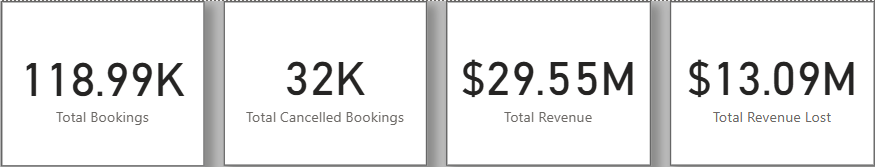

# 🏨 Hotel Booking Analysis Dashboard – Elevate Resort

Elevate resorts is a leading global hospitality brand, renowned for its wide range of accommodations and unparalleled guest experience.

Elevate resorts has noticed a stagnation in its revenue growth over the past couple of years. The elevate resorts is new to the world of extracting insights of the data, but they have taken their first step by collecting booking data for the last couple of years across their properties.

The management wants us to analyze the data to find some insights which can help them in coming out with strategies to improve the growth in revenue.


## 🧾 Dataset Overview

The datasets provided by management contains detailed records of hotel bookings and geographical data including:

- **Booking info:** Dates, length of stay, adults/children, cancellation status
- **Financial:** ADR (average daily rate), deposit type
- **Customer segments:** Market segment, customer type, assigned room, agent
- **Special requests**, **Country info** and many more data points.

You can view the full data dictionary


## 📌 Problem Statements, Solution approach and Key Findings

Elevate Resort’s management team has posed several key questions:

**❓ Which month(s) do we receive the most bookings, and how do cancellations trend over time?**

🔍 Here we are asked to create a Time-Series Plot which is best represented by using Line Plot with Total Bookings and Cancellations on y-axis and Months from Date field on x-axis.

💡 Key Insights:

- Elevate Resort gets the most bookings and cancellations in summer months of **July** and **August**.
- Also least bookings and cancellations in winter months of **November**, **December** and **January**.
- I've also found that the **Dec 5 2015** has the highest number of bookings.


**❓ Which countries are driving the highest number of bookings?**

🔍 Here we are asked to create Categorical Distribution of a numeric variable which is best represented by Stacked Bar Plot with Countries on y-axis and Total Bookings on x-axis. After adding a Topn filter to get Top 10 Countries by Total Bookings.

💡 Key Insights:

- **Portugal** is dominating in terms of Total Bookings followed by **United kingdom**, **France** and so on.


**❓ How do lead time and Deposit Type affect cancellation patterns?**

🔍 Here we are gonna create two plots:

- Scatter Plot - to unravel the correlation between lead Time and Total Cancellations.
- Clustered Column Chart - to see the Categorical Distribution of Total Bookings and Cancellations by Deposit Type.

💡 Key Insights

- We can see that there's a **negative correlation** between Lead Time and Total Cancellations, meaning lesser the Lead Time more Cancellations and vice versa.

- This draws a conclusion that the Cancellations to Bookings ratio for No Deposit is higher tha Non-Refundable deposit type. 
- Also there are hardly any bookings for Refundable type.
- Most cancellations came from bookings with **No Deposit**, implying a potential revenue leak.


**❓ What is the revenue breakdown across different market segments and customer types?**

🔍 To approach this question we first need to create a calculated column for "Total Revenue" because we don't have any. You can check the complete DAX logic below under the heading "🛠️ DAX".

Now we will use Stacked Column Chart with Market Segments on x-axis and Total Revenue on y-axis to see the Categorical Distribution of Revenue by each Market Segment.

And a Donut Chart with Customer type in legends and Total Revenue in Values field to see whole Revenue distribution through each Customer Type.

💡 Key Insights

- From the chart we can observe that **Online TA** and **Offline TA** are the major contributors in terms of revenue generation. 
Also the **Aviation** and **Complementary** are the least revenue generating sectors.

- By observing the chart we can see that **Transient** Customer Type holds the majority of revenue followed by Transient-Party, Contract and lastly Group.


**❓ Elevate Resorts wants to visualize major business numbers(KPIs) like Total Bookings, Cancellations, Revenue, and Revenue Lost?**

🔍 Again we need create "Revenue Lost" calculated column, You can check the complete DAX logic below under the heading "🛠️ DAX". For other KPIs we are covered.



## 📊 Power BI Dashboard Features

The dashboard includes:

- **KPI Cards** showing:
  - Total bookings
  - Total cancellations
  - Total revenue
  - Total revenue lost
- **Trend Line Chart** for monthly bookings and cancellations
- **Top 10 Country Analysis** by total bookings
- **Cancellation Analysis**:
  - By Lead Time (Scatter plot)
  - By Deposit Type (Clustered bar chart)
- **Revenue Analysis**:
  - By Market Segment
  - By Customer Type

All visuals are dynamic and respond to:
- Date range slicers
- Country filters


## 🛠️ DAX

Some key DAX formulas used to create measures and calculated columns:

- **Total Revenue** (Calculated Column)
```
Total_Revenue =
ROUND (
    IF (
        OR (
            hotel_bookings[deposit_type] = "Non Refund",
            hotel_bookings[is_cancelled] = 0
        ),
        hotel_bookings[adr] * hotel_bookings[length of stay],
        0
    ),
    2
)
```

- **Revenue Lost** (Calculated Column)
```
Revenue_Lost = 
IF (
    AND (
        hotel_bookings[deposit_type] <> "Non Refund",
        hotel_bookings[is_cancelled] = 1
    ),
    hotel_bookings[adr] * ( hotel_bookings[stays_in_week_nights] + hotel_bookings[stays_in_weekend_nights] ),
    BLANK ()
)
```


- **Total Bookings** (Measure)
```
Total Bookings = 
COUNT ( 
      hotel_bookings[Booking ID]
)
```

- **Total Bookings Cancelled** (Measure)
```
Total Bookings Cancelled = 
SUM ( 
    hotel_bookings[is_cancelled]
)
```


## 🧠 Tools Used
- **Power BI** for data modeling, visualization, and interactivity

- **DAX** for custom calculations

- **Excel** for initial dataset understanding & eyeballing.

_I designed this data and dashboard to simulate a real-world business scenario and solve practical problems using data. I aimed to balance performance metrics, storytelling, and visual clarity._

_Feel free to explore, give feedbacks, or suggest improvements!_
